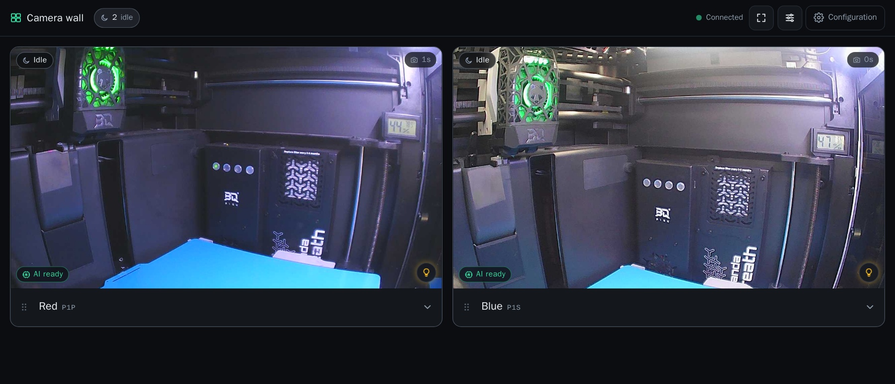

# bambu-mqtt-proxy

[](https://github.com/bradsjm/bambu-mqtt-proxy/actions/workflows/ci.yml)
[](https://github.com/bradsjm/bambu-mqtt-proxy/actions/workflows/docker-publish.yml)

[](LICENSE)

One MQTT endpoint for every Bambu Lab printer in your home. Bambu printers
tolerate only a handful of MQTT connections (~4 on P1/X1, a single one on A1),
and every app you point at a printer — Bambu Studio, Home Assistant, xtouch,
OctoPrint plugins — burns one of those slots. This small, stateless proxy poses
as the printer: your apps connect to it exactly as they would to the printer
(same port, `bblp` + access code, self-signed TLS), and it holds **one**
upstream connection per printer, routed by the serial number in the Bambu
topic path.

```
 Bambu Studio   Home Assistant   xtouch   ...        (≈10+ TLS clients)
      │               │             │
      └───────────────┼─────────────┘
                      ▼
        ┌──────────────────────────────┐
        │  bambu-mqtt-proxy            │
        │  TLS :8883 (self-signed)     │
        │  TLS :6000 raw camera        │
        │  serial → upstream table     │
        └───┬──────────────┬───────────┘
            │ 1 conn       │ 1 conn
            ▼              ▼
      P1S :8883        X1 :8883
```

| What you get | Why it matters |
|---|---|
| **Apps work unchanged** | Same port 8883, `bblp` username, printer access code, skipped certificate verification; payloads forwarded byte-for-byte (compatible with 2025+ signed-firmware printers). |
| **Printer connection limits stop mattering** | Any number of clients share one merged subscription per printer. |
| **One endpoint for the whole fleet** | MQTT topics route by serial (`device/{serial}/report`, `device/{serial}/request`); only raw camera connections route by access code instead. |
| **Optional Pushover notifications** | Print errors, HMS warnings, AI detection alerts, stopped or failed prints, and completions reach one Pushover account, with a camera snapshot when available. |
| **Printer outages ride out** | Capped exponential backoff with jitter, automatic reconnect and resubscribe, and a `pushall` warmup. Late joiners get full state (P1 printers otherwise send deltas only). |
| **Cameras, two ways** | A live multi-printer dashboard wall — P1/A1 cameras natively, X1/P2S/H2-series cameras through bundled FFmpeg — and a printer-compatible raw passthrough on port 6000. |
| **Optional AI failure detection** | With an OctoEverywhere Gadget key, snapshots from active prints are analyzed and the proxy pauses likely failures. No key, no uploads, no automatic pauses. |
| **Optional build-plate check** | With a Clef endpoint and key, one fresh snapshot is checked at print startup and the proxy sends `stop` when the plate looks occupied. Off without both. |
| **MCP endpoint** | `/mcp` exposes printer state, camera snapshots, and printer controls (pause, resume, emergency stop, chamber light, speed profile, AI monitoring toggle) to AI agents. |
| **Supervision-friendly** | `/livez`, `/readyz`, and `/status` for Docker/Kubernetes probes. |
| **Stateless and multi-arch** | No database, no volumes required; `linux/amd64` and `linux/arm64` images. |

## Quick start

Prerequisites:

1. Enable **LAN Mode** on each printer (Settings → Network → LAN Mode). Current
   firmware also requires **Developer Mode** for control commands such as pause
   and warmup.
2. Note each printer's access code and IP address.

### 1. Start the proxy

**Docker, configure in the browser (recommended)**

```sh
docker run -d --name bambu-mqtt-proxy -p 8883:8883 -p 6000:6000 -p 8080:8080 \
  -v bambu-mqtt-proxy:/config \
  ghcr.io/bradsjm/bambu-mqtt-proxy:latest
```

Open `http://<host>:8080/config`, add your printers, and choose **Save and
apply**. No config file is needed to start: until a printer is configured the
proxy serves only the HTTP health and configuration endpoints, and saving
creates `/config/bambu-mqtt-proxy.yaml`. Prefer a bind mount? Use
`-v $(pwd)/config:/config`; add `:ro` to lock the configuration — saving then
fails and leaves the running settings unchanged.

**Docker, environment variables only (stateless)**

```sh
docker run -d --name bambu-mqtt-proxy -p 8883:8883 -p 6000:6000 -p 8080:8080 \
  -e BMBPX_PRINTERS='serial=01P00A123456789,address=192.168.1.42:8883,tls=true,password=12345678,name=Garage P1S' \
  ghcr.io/bradsjm/bambu-mqtt-proxy:latest
```

The optional `name=…` is a friendly display label for the camera wall; MQTT
always routes by serial.

**Docker Compose**

```sh
cp compose.example.yaml compose.yaml   # then fill in your printers
docker compose up -d
```

**From source**

```sh
scripts/setup-toolchain.sh               # installs the Go version pinned by go.mod
go build -o bambu-mqtt-proxy ./cmd/bambu-mqtt-proxy
./bambu-mqtt-proxy -config bambu-mqtt-proxy.yaml
```

### 2. Point your apps at the proxy

| Your app | Connect to | Username | Password |
|---|---|---|---|
| MQTT clients — Bambu Studio, Home Assistant, xtouch, OctoPrint plugins | `<proxy-host>:8883` | `bblp` | any configured printer's access code |
| Camera apps speaking the printer camera protocol | `<proxy-host>:6000` | `bblp` | the target printer's access code |

MQTT traffic carries the serial in its topics, so one endpoint serves every
configured printer. Camera connections carry no serial: the access code
selects the printer, so give each printer a unique access code (the proxy does
not reject duplicates, and MQTT routing is unaffected).

## Configuration

A YAML file and `BMBPX_*` environment variables may be combined; env values
override file values per field.

| Source | Best for |
|---|---|
| [`/config`](#configuration-page-config) web page | Adding or editing printers in a browser; saving applies changes without a container restart |
| `BMBPX_*` variables | Container deployments and secret overrides |
| YAML file | Full control over listeners, TLS, and behavior tuning — see [`config.example.yaml`](config.example.yaml) and [DESIGN.md §9](DESIGN.md) for the full reference |

```yaml
listen:
  - port: 8883
    tls: true
    cert_file: ./certs/proxy.crt   # generated on first start if missing
    key_file: ./certs/proxy.key
auth:
  mode: printer                    # require bblp + a configured access code
printers:
  - serial: "01P00A123456789"
    address: "192.168.1.42:8883"
    tls: true
    insecure_skip_verify: true
    username: "bblp"
    password: "12345678"
  - serial: "01S00C351100139"
    name: "Garage P1S"               # optional friendly label for the camera wall; never used for routing
    model: "P1S"                     # optional; camera support is auto-detected from the serial prefix
    address: "192.168.1.42:8883"
    tls: true
    insecure_skip_verify: true
    username: "bblp"
    password: "87654321"
behavior:
  warmup_commands:
    - '{"pushing":{"sequence_id":"0","command":"pushall"}}'
http:
  port: 8080                         # 0 disables the HTTP server entirely
camera:
  enabled: true                      # false removes camera routes, the camera wall, and the raw camera listener on port 6000
mcp:
  enabled: true                      # default; set false to remove the MCP endpoint at /mcp
notifications:
  enabled: false                     # optional Pushover print alerts; see below
  provider: pushover
  pushover:
    app_token: ""                    # from pushover.net
    user_key: ""
log:
  level: info
```

| Environment variable | Default | Meaning |
|---|---|---|
| `BMBPX_PRINTERS` | — | Semicolon-separated printers: `serial=…,address=…,password=…[,name=…][,model=…][,username=…][,tls=…][,insecure_skip_verify=…][,panda_breath=ws://…][,panda_pwr=http://…]` |
| `BMBPX_LISTEN_PORT` | `8883` | Downstream MQTT port |
| `BMBPX_LISTEN_TLS` | `true` | TLS on the downstream listener |
| `BMBPX_CERT_FILE` / `BMBPX_KEY_FILE` | *(empty)* | Empty = ephemeral in-memory self-signed certificate |
| `BMBPX_AUTH_MODE` | `printer` | `printer` or `accept_all` |
| `BMBPX_LOG_LEVEL` | `info` | `info` logs client and upstream state, subscriptions, retries, and backoff delays; `debug` adds per-packet request routing |
| `BMBPX_HTTP_PORT` | `8080` | Shared health, camera, and MCP HTTP port; `0` disables HTTP (the raw camera listener on 6000 keeps serving while cameras are enabled) |
| `BMBPX_CAMERA_ENABLED` | `true` | `false` removes the camera routes, the camera wall, their MQTT report subscriptions, and the raw camera listener on port 6000 |
| `BMBPX_MCP_ENABLED` | `true` | `false` removes the MCP endpoint at `/mcp`; the endpoint is also off when `http.port` is `0` |
| `BMBPX_PLATECHECK_ENDPOINT` | *(empty)* | Overrides the stored Clef endpoint whenever the variable exists (an empty value clears it). See [Build-plate check](#build-plate-check-optional) |
| `BMBPX_PLATECHECK_API_KEY` | *(empty)* | Overrides the stored Clef API key whenever the variable exists. The key is sent only to the endpoint it is paired with. See [Build-plate check](#build-plate-check-optional) |
| `BMBPX_OCTOEVERYWHERE_API_KEY` | *(empty)* | Overrides the stored Gadget API key whenever the variable exists — an empty value clears the stored key. Setting a key consents to external snapshot uploads and automatic pauses — see [Gadget AI print-failure detection](#gadget-ai-print-failure-detection-optional) |

## HTTP endpoints

Health, camera, and MCP endpoints share one listener (port 8080 by default).
When cameras are disabled only the health endpoints (and `/mcp`, unless
disabled) are served; with `http.port: 0` no HTTP server starts at all. The
raw camera endpoint is separate: it listens on TLS port 6000 whenever cameras
are enabled — including with `http.port: 0` — and never starts when they are
disabled.

| Endpoint | Purpose |
|---|---|
| `/` | Redirects to `/config` until a printer is configured, then to `/camwall` (no redirect while cameras are disabled) |
| `/livez`, `/readyz` | `200 ok` once serving (printer state deliberately excluded — clients stay connected while printers recover) |
| `/status` | JSON: `{"status":"ok","upstreams":{"<serial>":true\|false}}`, plus a `detection` map per printer when AI detection is enabled and a `platecheck` state when the camera feature is on |
| `POST /platecheck/snapshots` | Plate-check dry run used by the `/config` page: checks one fresh snapshot per camera-capable printer and returns the exact images and scores. Sends no printer command. Mounted when cameras are on |
| `/activity`, `/activity/{serial}` | Recent per-printer events (in memory; cleared when the proxy restarts) |
| `/camera/{serial}/snapshot` | Single JPEG frame (P1/A1 native; X1/P2S/H2-series converted server-side with FFmpeg) |
| `/camera/{serial}/stream` | Live multipart MJPEG stream (same model support as the snapshot) |
| `/camera/status` | Display state for every printer (no credentials) |
| `/camera/events` | The same display state as server-sent events: on connect, on change, and at least every 10 s |
| `/camwall` | Multi-printer camera wall dashboard |
| `/config`, `/config/api` | Browser configuration page and its JSON API (`GET` never returns access codes; `PUT` saves and applies) |
| `/favicon.ico`, `/apple-touch-icon.png` | Browser-tab, bookmark, and home-screen icons |
| `/mcp` | Model Context Protocol endpoint (off with `BMBPX_MCP_ENABLED=false` or `http.port: 0`) |
| `/control/{serial}` | Printer control from the camera wall: `POST` `{"action":"light\|pause\|resume\|speed\|stop"}` (see below) |

### Camera wall

Open `http://<host>:8080/camwall`.



- **Controls** — each tile carries buttons for chamber light, pause/resume,
  and emergency stop, plus a speed-profile selector. They `POST` to
  `/control/{serial}` with a JSON body:

  ```json
  {"action": "light|pause|resume|speed|stop", "on": true, "profile": "silent|standard|sport|ludicrous"}
  ```

  `on` is required for `light`; `profile` is required for `speed`. Responses:
  `200` `{"serial":"...","action":"...","sent":true}`; `400` invalid body,
  unknown action, missing `on`, or bad profile; `404` unknown printer;
  `409` the action is not available in the printer's current state; `502`
  the command could not be sent; `503` the printer is not connected. Errors
  return `{"error":"..."}`. There is no authentication and no confirmation;
  stop is the emergency stop and sends immediately.

- **Tiles** pair each camera with color-coded print state, a progress edge,
  and a headline progress/time-left figure. Print errors and HMS alerts appear
  as a severity-colored banner with a suggested fix, resolved from the
  [PrintARA Bambu error code database](https://printara3d.com/tools/bambu-error-codes/).
- **Detail levels** — click a tile's details panel to step through compact,
  vitals (layer count, finish time, nozzle/bed/chamber temperature gauges),
  and full details. Full details add the recent activity log (print state
  changes, alerts, connectivity, AI detection events). The log is held in
  memory and starts empty after each proxy restart.
- **Fleet chips** in the top bar count printers per state and double as
  filters; **needs attention** collects failed, paused, stale, and
  serious-alert printers, plus detection warnings or pause attempts when the
  Gadget integration is on.
- **Layout** — click a camera to focus it full-width; drag the grip (or use
  the arrow keys when focused) to reorder tiles. Tiles resize to the window,
  from one column on phones to a grid on wall displays.
- **Live streams** — focused cameras and active prints (running or paused)
  hold live streams, up to four visible, connected printers by default. Other
  visible tiles use snapshots; background tabs and disconnected printers hold
  no camera connection.
- **Settings** — the dialog sets the live-stream cap (1–16), snapshot refresh
  interval (2–60 s), tile size, and detail level, plus a keep-screen-awake
  option. Order, filters, and settings persist in that browser's local storage
  only; the proxy stores no wall state.
- **URL parameters** — `?kiosk=1` hides the top bar and always requests a
  screen wake lock; `?maxLive=` and `?interval=` override stored stream
  settings. Browsers grant wake locks only on HTTPS or `localhost`, and over
  plain HTTP they allow about six connections per host, shared by live
  streams, snapshots, and the status stream.
- **State source** — the wall subscribes to `/camera/events`; report-derived
  state appears when the proxy receives printer reports, such as when an MQTT
  client or the wall itself holds a report subscription. A busy printer with
  no report for 2 minutes shows "no recent data".
- **Stateless privacy** — camera and camera-wall endpoints are unauthenticated
  by design: anyone who can reach the HTTP port can view cameras and
  telemetry. The state endpoints never include credentials.

Camera capture is automatic for configured printers: the model is detected
from the serial prefix, so no per-printer configuration is required. Two
transports exist:

| Model | Serial prefix | Web transport |
|---|---|---|
| P1P | `01P` | Native chamber JPEG protocol |
| P1S | `01S` | Native chamber JPEG protocol |
| A1 MINI | `030` | Native chamber JPEG protocol |
| A1 | `039` | Native chamber JPEG protocol |
| X1 | `00W` | RTSPS, converted server-side with FFmpeg |
| X1C | `00M` | RTSPS, converted server-side with FFmpeg |
| X1E | `03W` | RTSPS, converted server-side with FFmpeg |
| P2S | `22E` | RTSPS, converted server-side with FFmpeg |
| H2S | `093` | RTSPS, converted server-side with FFmpeg |
| H2D | `094` | RTSPS, converted server-side with FFmpeg |

For RTSPS models the proxy pulls `rtsps://<printer>:322/streaming/live/1`
with the printer's `bblp` access code and converts the video to JPEG frames
for the wall at a fixed low rate. H2-series firmware may need
**Settings → LAN Mode Liveview** enabled on the printer for port 322 to
answer. The Docker images bundle FFmpeg, so no extra setup is needed there;
a native install needs `ffmpeg` on `PATH`. Without it, RTSPS models show
"camera unavailable: FFmpeg is not installed" on the wall, one warning is
logged at startup, and P1/A1 cameras keep working — install FFmpeg and
restart the proxy to enable them.

An explicit `model` field overrides the inference. Ineligible serials
(unsupported models, unknown prefixes) answer `404` (unknown serial) or
`422` (unsupported model) without ever opening a camera socket. The Gadget AI
detection feature covers only the P1/A1 chamber-protocol models. Chamber
temperature is shown only for models with a physical chamber sensor (the
X1/X2/P2/H2 classes); P1 and A1 models omit the reading even if their report
contains `chamber_temper`.

### Raw camera passthrough (port 6000)

- TLS listener speaking the printer's own camera protocol: the client sends
  the printer's 80-byte `bblp` + access-code authentication and receives the
  printer's native JPEG frame flow unchanged.
- Serves the chamber-protocol models (P1/A1) only; X1/P2S/H2-series cameras
  are not proxied on this port.
- Starts with the camera feature — even with `http.port: 0` — and a port or
  certificate failure fails startup with a wrapped error.
- The access code is the routing key, so printers need unique access codes for
  raw camera clients to reach the right printer (see [Quick start](#2-point-your-apps-at-the-proxy)).

### MCP endpoint (`/mcp`)

On by default; disable with `BMBPX_MCP_ENABLED=false`. MCP protocol
2026-07-28 over Streamable HTTP:

- **Core read-only tools** — `list_printers`, `get_printer_state`,
  `get_camera_snapshot`, and `watch_printer`.
- **Core control tools** — `pause_print`, `resume_print`, `stop_print` (a
  destructive emergency stop with no confirmation), `set_chamber_light`,
  and `set_speed_profile`.
- **Module tools**, served by their modules when those modules run:
  `set_ai_monitoring` with the Gadget AI detection (which also needs the
  camera feature), and `get_job_preview` with the job preview feature.
- **Printer state** — `get_printer_state` returns
  `state.modules.<name>` per running module (for example
  `state.modules.jobpreview` with the archived job preview,
  `state.modules.pandabreath` with the device `link`, its fresh
  `chamber_c` reading, and the `trend` and signed `rate_c_per_min`, or
  `state.modules.pandapwr` with the device `link` and its fresh
  `power_w` in watts; Panda PWR has no MCP tool), so
  one tool stays current whatever capabilities are enabled.
- `watch_printer` emits one event when a module's state changes: kind
  `module_changed` with a `module` field naming the module. A Panda PWR
  `link` change emits the event; value churn such as a Panda Breath
  temperature step or a Panda PWR power change does not count as a
  change.
- **Resource** — `bambu://printers/{serial}/state`, a typed live state
  projection that clients can subscribe to.
- The endpoint never learns printer credentials; control commands go through
  the same allow-listed command service as the camera wall.

### Configuration page (`/config`)

- Edits the YAML config file (the `-config` path, default
  `bambu-mqtt-proxy.yaml`). Saving validates the settings, writes the file
  (mode `0600`, created along with its directory when missing), and restarts
  every service in-process; MQTT clients reconnect as they would after a
  printer reboot. If the saved settings fail to start (for example a port
  already in use), the previous file is restored and the page shows the error.
- Never displays or returns access codes: a blank code keeps the stored one,
  and changing a printer's address requires entering its code again.
- Marks each setting overridden by a `BMBPX_*` variable; those still win.
  Saving rewrites the file, so comments in it are not kept.
- Handles Pushover credentials the same way in the Notifications section:
  they are never displayed or returned, a blank field keeps the stored
  value, and **Send test notification** sends one test message without
  saving.

## Build-plate check (optional)

The `platecheck` section (editable on the `/config` page) checks the build
plate when a print starts. Set `endpoint` (a full HTTPS URL of a Cloudflare
Workers AI or self-hosted Clef model), `api_key`, `model` (`clef` or
`clef-flash`), and `stop_confidence` (0.50 to 0.99 in 0.01 steps, default
0.50). Without an explicit `enabled`, the check runs when both endpoint and key
are set. `BMBPX_PLATECHECK_ENDPOINT` and `BMBPX_PLATECHECK_API_KEY` override the
stored values whenever they exist. The key is write-only on the page, a blank
value keeps the stored key, and a stored or environment key is never sent to a
different endpoint than the one it belongs to.

For each new print job, the proxy waits for a fresh camera frame, may turn the
chamber light on, uploads that one JPEG to the endpoint, and sends `stop` only
when the model is sure the view is usable (assessable at least 0.8) and the
occupied probability is above `stop_confidence`. It never sends another
command. Every failure, unclear image, or missing camera lets the print
continue. It checks only prints that start while the proxy watches; a print
already underway when the proxy attaches is never stopped. A stop sent during
PREPARE may be repeated once when the job first reaches RUNNING with layer 0.

This is a best-effort check, not a collision interlock. Slicers connect to the
printer directly, so the print may already be moving when the stop arrives, and
the printer may refuse the command. Stop requests, failures, and unconfirmed
stops go to the activity log and, with notifications on, to Pushover. The camera
wall shows a `Plate check` panel.

The `/config` page has a `Test plate check` button. It checks the key and then
uploads one current snapshot from each camera to the endpoint, showing each image
and its scores. It saves nothing and sends no printer command. It needs the
camera feature. Camera snapshots leave your LAN when you use it or enable the
check.

## Gadget AI print-failure detection (optional)

Detection is configured in the `detection` section of the config file
(editable on the `/config` page): `enabled` switches the feature, and
`api_key` stores an
[OctoEverywhere Gadget API key](https://octoeverywhere.com/gadgetapi)
([API documentation](https://docs.octoeverywhere.com/ai-failure-detection-apis/overview/)).
The stored key never leaves the server: the configuration API reports only
whether a key exists, a blank value on save keeps the stored key, and the
config file is written with owner-only permissions (0600). Without an
explicit `enabled`, detection follows the key: it runs when a key is
configured and stays off otherwise. `enabled: false` disables the feature
even when a key exists, and enabling without any key fails validation. The
key cannot be removed from the page — use the switch. There is no usage
bookkeeping; the proxy stays stateless.

`BMBPX_OCTOEVERYWHERE_API_KEY` overrides the stored key whenever the
variable exists, including set-but-empty, which clears it. While a print is
active on a
camera-capable printer, the proxy uploads the current camera snapshot to the
Gadget service at a policy-selected pace, based on the minimum and recommended
intervals the service returns, and receives a print-quality score (1–10) plus
warning and pause recommendations:

- Warnings surface per printer as a `detection` object on `/camera/status`,
  `/camera/events`, and `/status`; each object's `state` — starting, idle,
  monitoring, attention, paused, degraded, unsupported, or blocked — shows at
  a glance what detection is doing for that printer.
- A fresh warning result can set a reported Standard, Sport, or Ludicrous
  profile to Silent (50%). When the warning clears, the proxy restores the saved
  profile only while it still owns Silent. It skips unknown or stale profiles
  and does not overwrite a later profile change made at the printer.
- A pause recommendation sends a single LAN `pause` command. Each
  recommendation pauses at most once; the proxy never retries a pause and
  never resumes the print.
- The AI badge on a camera wall tile toggles detection for that printer.

**Consent.** Enabling detection with a key is an explicit opt-in to the
service: camera
snapshots leave your LAN for OctoEverywhere's servers, and the proxy can
temporarily set print speed to Silent and pause prints without asking. Leave
the key unset to keep every image local and automatic printer controls off.
OctoEverywhere documents that images submitted through the public Gadget API
are not used for AI model training.

**Eligibility.** Detection rides on the camera pipeline, so it covers exactly
the camera-capable models (P1P, P1S, A1, A1MINI) and only while telemetry
shows a print actively running. It requires the camera feature
(`BMBPX_CAMERA_ENABLED`): with cameras disabled and a key set, nothing runs
and every printer's `detection` object reports `blocked`. Detection keeps
running with `BMBPX_HTTP_PORT=0`; only its status endpoints are then absent.

**Allowance.** Enforcement lives entirely on OctoEverywhere's side. Each
account includes 90,000 free inspection calls per monthly billing period —
about 500 print hours at the 20-second cadence the pricing assumes, about 125
hours if the service directs 5-second inspections — and the allowance is
shared across the whole account: the same key in any other printer, tool, or
proxy instance consumes the same budget. Accounts default to **Free Usage
Only**, so inspections stop at the allowance instead of incurring charges.

**Failures and limits.**

- Network errors, timeouts, server errors, and rate limits are retried with
  capped backoff and never affect printing or camera serving.
- Invalid or disabled keys, billing failures, IP restrictions, and exhausted
  free allowances suspend detection until restart; account errors suspend it
  across all printers. Logs show safe, structured reasons, not provider error
  text.
- Monitoring is per-print and advisory — these are heuristics, not a guarantee
  of failure detection. Pausing needs a printer that accepts LAN commands
  (Developer Mode on 2025+ signed firmware, as for any client).
- Results, policy timing, and speed ownership stay in memory; a restart clears
  every status and context. The proxy then cannot restore a Silent profile it
  set before the restart.

Full policy, retry, and state-machine detail lives in
[DESIGN.md §6.1](DESIGN.md).

## Pushover notifications (optional)

Enable the Notifications section on `/config` (or the `notifications` YAML
block) to send print alerts to one [Pushover](https://pushover.net/) account.

- **What notifies** — a print finishing, failing, or stopping before it
  finishes; printer errors and HMS warnings; AI detection warnings and AI
  pause attempts, including failed or unconfirmed ones; and a pause that
  leaves an active printer alert. Starts, resumes, reconnects, and cleared
  alerts do not notify.
- **What arrives** — events within 2 seconds group into one message per
  printer: the event summaries, the running file, and each active alert with
  its error code and suggested fix. The title is the printer's name or
  serial. A camera snapshot attaches when one is available.
- **Setup** — create a Pushover application for the app token, enter both
  values on `/config`, save, and use **Send test notification**. Pushover
  messages arrive from your own application, so you can filter them.
- **Delivery is best-effort** — one attempt per message, no retry queue, and
  nothing is stored; a busy queue or failed delivery logs a warning and the
  proxy moves on. A restart may repeat one active alert. No `BMBPX_*`
  variable exists for this feature: YAML and `/config` own it.
- **Privacy** — enabling this sends print metadata (event text, file name,
  error codes) and, when a camera is available, camera frames to Pushover's
  servers. Leave notifications disabled to keep everything local.

## Security notes

- Runs as a non-root user in the container. The config file and environment
  contain printer access codes, and the config file also holds the Pushover
  app token and user key when notifications are configured — protect them
  accordingly, and never commit `bambu-mqtt-proxy.yaml`.
- TLS certificates are unverified on both hops, matching Bambu's own LAN
  protocol; the proxy is intended for trusted home LANs.
- The camera endpoints, `/mcp`, and the `/config` page are unauthenticated:
  anyone who can reach the HTTP port can view cameras and printer state,
  fetch snapshots, and change settings (though never read access codes, or
  send a stored code to a new address). The camera wall's
  `POST /control/{serial}` and the MCP control tools can also pause, resume,
  change speed, toggle the chamber light, and **emergency-stop** prints
  without login; heater and temperature commands are never exposed. Browser
  requests from other sites are rejected. Set `BMBPX_MCP_ENABLED=false`,
  mount the config file read-only, or set `http.port: 0` to narrow the
  surface.
- The raw camera endpoint on port 6000 authenticates with `bblp` plus a
  configured printer access code; the code selects the printer.
- The OctoEverywhere key is a secret: keep it in your environment (`.env` is
  git-ignored) and share the account with caution — it authorizes external
  snapshot uploads and automatic pauses, and usage is billed per
  OctoEverywhere account, not per proxy.

## Development

```sh
go test -race -p 1 ./...      # unit + fake-printer integration suite
go build ./cmd/bambu-mqtt-proxy
docker buildx build --platform linux/amd64,linux/arm64 -t bambu-mqtt-proxy .
```

[DESIGN.md](DESIGN.md) covers the protocol research, package boundaries,
failure modes, and the verification plan behind this proxy.

## License

[MIT](LICENSE)
